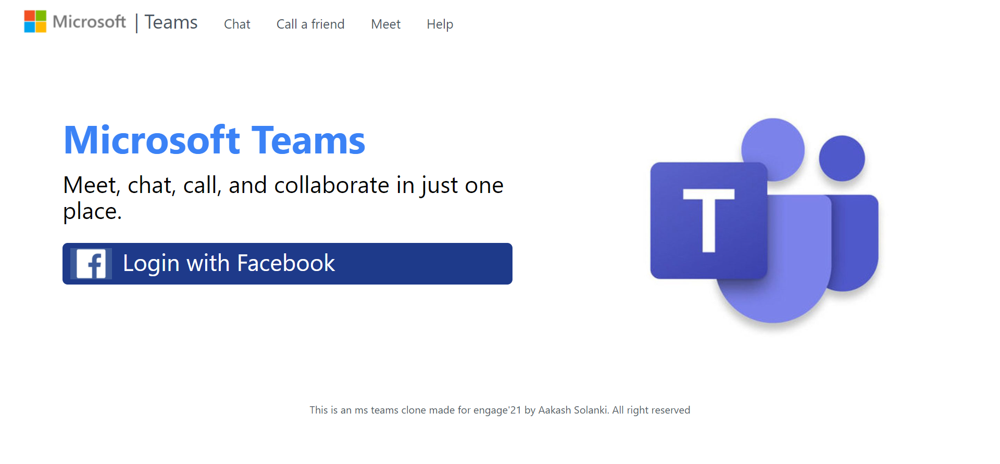
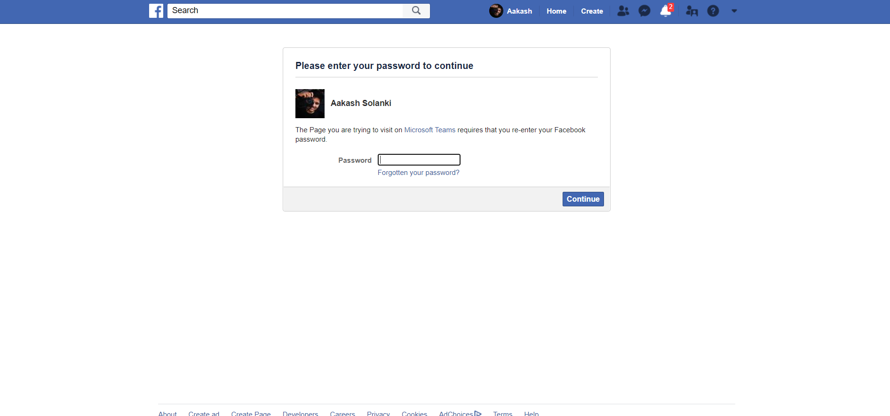
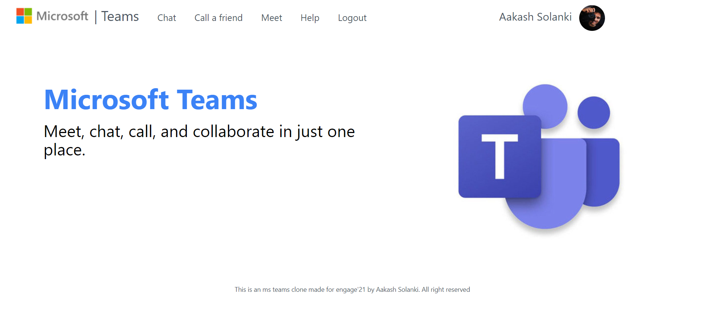
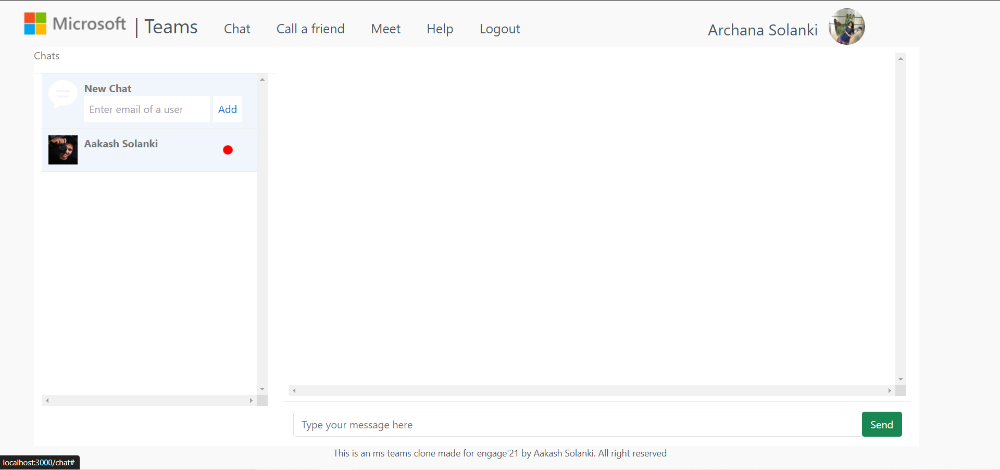
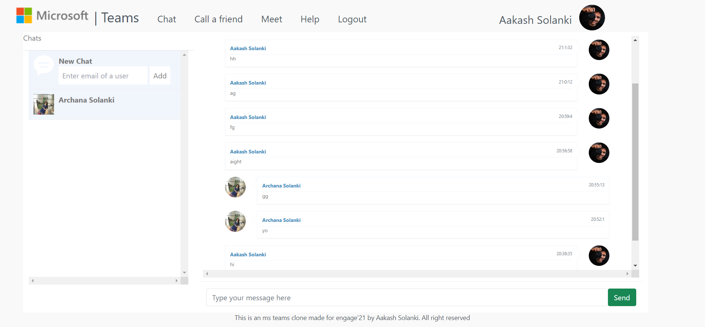
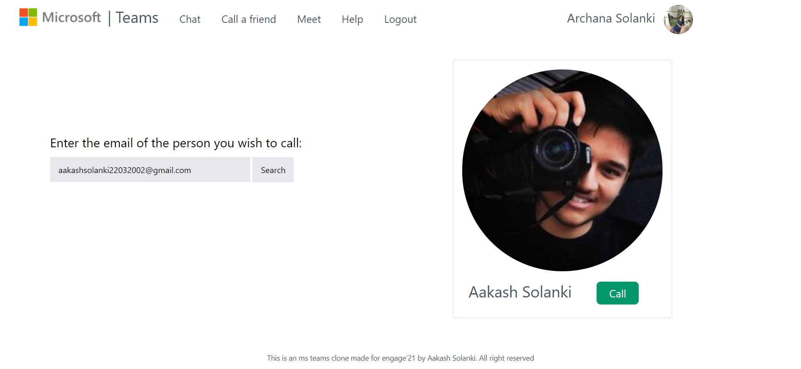
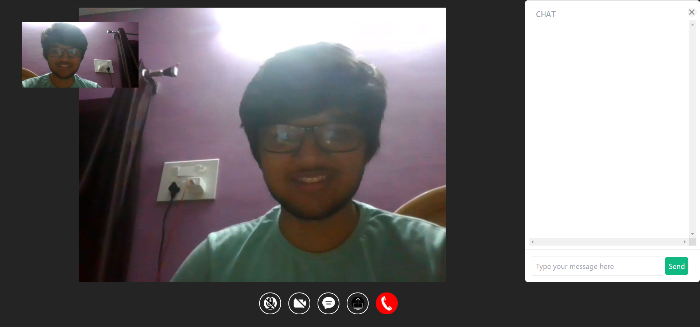
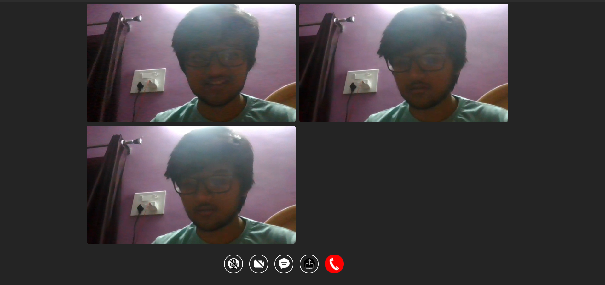
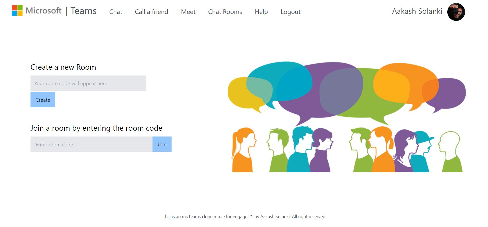
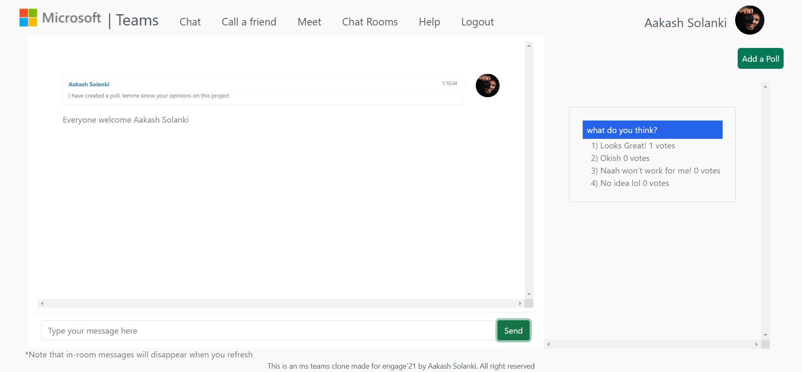

# TeamsClone

This is the documentation for the Microsoft Teams Clone Website made for Engage Mentorship Program 2021 by Aakash Solanki.

Video Demo- https://youtu.be/h-Yp0fW6RX4

Website Link: https://teams-clone-a22solanki.herokuapp.com/

# Overview:
The website has been made in Nodejs with MongoDB as the database. The key features offered by the website are:
1. Chat feature which allows for real-time chat with other users on the website.
2. One-on-one video calling feature which includes real time chatting and other options like screen sharing etc. Functionality to continue the chat after the call.
3. Group video conferencing
4. Chat Rooms with add poll feature

# Implementation Details:
I followed the agile methodology for building this website. Here is a brief overview of how i organized the entire work into small deliverables-
1. Planning the Tech Stack: I started by deciding the framework for the application and finalizing other tech stacks like which library I will use to implement video calling feature etc.
2. Creating a Simple video Calling feature: Starting from 21st June i worked on the video calling feature and made a simple app by which 2 users could connect to each other. I used socket.io and peerjs library (an API for WebRTC) to achieve this.
3. Adding user authentication: I then added user authentication via fb using passport.js library.
4. Chat Feature: I then implemented the chat feature. I used mongoDB to store all my data. Later in this sprint, I synchronized the video calling chat feature with the normal chat which was a required feature in the Adopt phase. 
5. Rooms: Finally I added group video-calling and chatting rooms and added a poll feature for chat rooms.

Below is a snippet of the Login page of the website which opens up as soon as you open the website.

User Authentication has been implemented using express sessions and passport.js library with a Facebook Strategy. As soon as the user clicks on Login with Facebook button, he/she is directed to the facebook authentication page as shown below:

# Home Page:
Once the user is authenticated, he is directed to the home page of the website. The home page has a welcome message, a logout button, picture of the user and a nav bar with links to different sections of the website.

# Chat Functionality:
The website allows for real-time chatting between 2 users. To get started, click on the chat button in the nav bar. You will be redirected to the chat page which is unique for every user.
On the left side, a user can see all the chats with a feature to start a New Chat on the top. To start a new chat with someone, type his/her email in the ‘enter email of the user’ input field and click on Add.

The red mark on a chat indicates unread messages.
Users can then send messages to their desired contacts. The chat window looks like this:

# Call a Friend Functionality:
The website allows you to video chat with your friends. To call a friend, navigate to the calls page by clicking on Call a friend in the nav bar. Enter the email of the user you wish to call in the ‘enter email’ input field and click on Search.

If no user with the entered email exists, the server will respond  with an error message which will be displayed to the user. If a user is found, the server returns the users’ name and profile pic as well as a call button is displayed.

As soon as you (say user A) click on the call button, a message is sent to the second user (say user B) which contains the link to join the meeting. User A is redirected to the calls page where he can wait until user B joins. The UI of the video call page looks like this:

There are features for muting your audio and video, sharing your screen as well as chatting in real time with the other user. Also, the in-call chat is synchronized with the original chat and you can access all your in-call messages after the call in the personal chat.

# Meet Functionality:
This feature allows you to have a group video call with your friends.To start a new meet simply click on the create button. A meet code will appear. You can click on the copy button and send the code to all your friends with whom you wish to chat. To join someone’s video call room, simply paste the meet code in the “Enter meeting code” and click on join.
The group call page has similar features as in the one-on-one calling page except for a grid layout for video elements-

# Chat Rooms Functionality
Chat rooms allow you to have valuable conversations with any number of users. The joining procedure works the same way as in the meet functionality-

Every time a user joins the room, a welcome message is generated. You can also create polls in chat rooms to get opinions from the people present in the room. Below is a snippet of a chat room:

The poll feature works with the help of web sockets.
To end with, you have a Logout button to Log yourself out of the website and a Help button which redirects you to this page.

